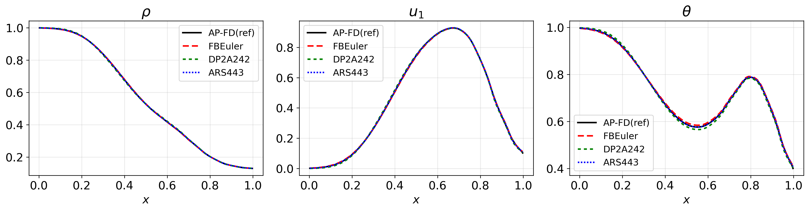
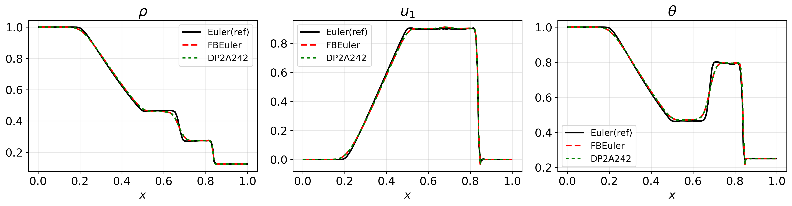
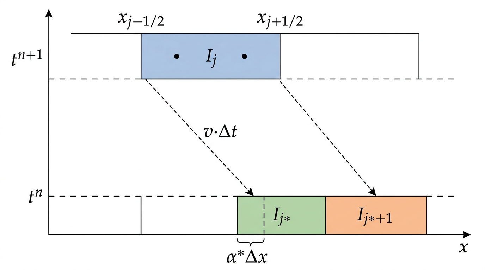

# SLDG-IMEX Boltzmann Solver for the Sod Shock Tube

An asymptotic-preserving **Semi-Lagrangian Discontinuous Galerkin (SLDG)** solver for the Boltzmann equation, using **IMEX Runge-Kutta** time integration with **BGK penalisation** and **bound-preserving limiters**. Validated on the classical **Sod shock tube** problem across kinetic and hydrodynamic regimes.

| Kinetic regime (eps = 1e-2) | Hydrodynamic limit (eps = 1e-8) |
|---|---|
|  |  |

## The Boltzmann Equation

The Boltzmann equation governs the evolution of a particle distribution function f(t, x, v) through free transport and binary collisions:

$$\partial_t f + v \cdot \nabla_x f = \frac{1}{\varepsilon} Q(f, f)$$

where the Knudsen number $\varepsilon$ controls the collision frequency. The macroscopic observables — density $\rho$, bulk velocity $u$, and temperature $\theta$ — are moments of $f$:

$$\rho = \int f \, dv, \quad \rho u = \int v f \, dv, \quad \rho\theta = \frac{1}{2}\int |v - u|^2 f \, dv.$$

As $\varepsilon \to 0$, $f$ relaxes to the local **Maxwellian**

$$\mathcal{M}_{[\rho,u,\theta]}(v) = \frac{\rho}{2\pi\theta} \exp\!\left(-\frac{|v - u|^2}{2\theta}\right)$$

and the moments satisfy the **compressible Euler equations**. A good numerical method must handle both the rarefied ($\varepsilon \sim 1$) and hydrodynamic ($\varepsilon \to 0$) regimes seamlessly — this is the **asymptotic-preserving (AP)** property.

---

## Numerical Method

### 1. Nodal Discontinuous Galerkin Framework

The spatial domain $[x_L, x_R]$ is partitioned into $N_x$ elements $I_j$ of width $\Delta x$. On each element, we place $k{+}1$ **Gauss-Legendre** nodal points and represent the solution through Lagrange interpolation:

$$f(x, v) = \sum_{j=1}^{N_x} \sum_{p=0}^{k} f(x_{j,p}, v) \, \ell_{j,p}(x).$$

Working with nodal values (rather than modal coefficients) provides a natural interface with the pointwise Maxwellian $\mathcal{M}$ and allows spatially varying Knudsen numbers.

> **Implementation:** `util/discretization.py` → `XGrid` builds the Gauss-Legendre nodes via `legendre_quadrature()`; `util/helper_functions.py` → `lagrange_at()` evaluates the Lagrange basis.

### 2. Semi-Lagrangian Characteristic Tracing

The key idea of the SLDG method is to rewrite the Boltzmann equation along characteristics:

$$\frac{d}{dt} f(t, x(t), v) = \frac{1}{\varepsilon} Q(f), \qquad \frac{d}{dt} x(t) = v.$$

For each velocity $v$, characteristics are straight lines. Using a **characteristic Galerkin weak formulation** with the adjoint test function, one obtains:

$$\int_{I_j} f^{n+1} \Psi \, dx = \int_{I_j - v \Delta t} f^n \, \Psi(x + v\Delta t) \, dx + \text{(collision terms)}.$$

The transport part reduces to **reconstructing** $f^n$ on the **upstream interval** $I_j - v\Delta t$. Because characteristics are straight lines, this upstream interval is determined exactly — no ODE integration is needed.

<p align="center">
  
</p>

The upstream left edge $x_{j-1/2} - v\Delta t$ generally falls inside some element $I_{j^{*}}$, at a fractional offset $\alpha \in [0,1)$ from the element boundary. Inserting the DG representation and performing Gauss quadrature on both sides yields a compact **matrix multiplication**:

$$\mathcal{S}_{v, \Delta t}[f]_{j, \cdot} = A(\alpha) \, f_{j^{*}, \cdot} + B(\alpha) \, f_{j^{*}+1, \cdot}$$

where the **updating matrices** $A(\alpha)$ and $B(\alpha)$ are:

$$A(\alpha)_{p_j, p} = \frac{1 - \alpha}{\omega_{p_j}} \sum_q \omega_q \, \tilde{\ell}_p\!\left(\alpha + u_q(1{-}\alpha)\right) \tilde{\ell}_{p_j}\!\left(u_q(1{-}\alpha)\right)$$

$$B(\alpha)_{p_j, p} = \frac{\alpha}{\omega_{p_j}} \sum_q \omega_q \, \tilde{\ell}_p(\alpha \, u_q) \, \tilde{\ell}_{p_j}\!\left(\alpha(u_q{-}1)+1\right)$$

with $\omega_q$, $u_q$ the Gauss-Legendre weights and nodes, and $\tilde\ell_p$ the Lagrange polynomials on $[0,1]$. Since each velocity component $v$ determines $\alpha$ and $j^{*}$ independently, the full transport step $\mathcal{S}[f]$ is a loop over all velocities, each involving only two small matrix-vector products per element. Importantly, **there is no CFL restriction** — the shift $v\Delta t$ can span multiple elements.

> **Implementation:** `util/SLDG_integrator.py` → `SLDGIntegrator.integrate()` is the main entry point. `_updating_matrices()` computes $A(\alpha)$ and $B(\alpha)$; `_search_segments()` locates the upstream element $j^{*}$; `_apply_bc()` handles periodic / Neumann / inflow boundary conditions.

### 3. BGK Penalisation and Asymptotic Preserving Property

A direct implicit treatment of the full collision operator $Q(f,f)$ would be prohibitively expensive. Instead, we use the **BGK penalisation** decomposition:

$$Q(f) = \underbrace{\bigl[Q(f) - \beta(\mathcal{M}_f - f)\bigr]}_{G_P(f),\;\text{explicit}} \;+\; \underbrace{\beta(\mathcal{M}_f - f)}_{Q_P(f),\;\text{implicit}}$$

where $\beta = \rho$ is a penalisation weight. The stiff relaxation term $Q_P$ (which drives $f \to \mathcal{M}$) is treated **implicitly**, while the remainder $G_P$ (which is $O(\varepsilon)$ near equilibrium) is treated **explicitly**.

The first-order AP-SLDG scheme reads:

$$f^{n+1} = \frac{\beta^{n+1} \tilde{a} \Delta t}{\varepsilon + \beta^{n+1} \tilde{a} \Delta t}\,\mathcal{M}^{n+1} + \frac{\varepsilon}{\varepsilon + \beta^{n+1} \tilde{a} \Delta t}\!\left(\mathcal{S}[f^n] + \frac{\Delta t}{\varepsilon}\mathcal{S}[G_P(f^n)]\right).$$

When $\varepsilon \to 0$ the first term dominates and $f^{n+1} \to \mathcal{M}^{n+1}$, recovering the Euler limit. When $\varepsilon \sim 1$, the scheme reduces to an explicit DG method for the full Boltzmann equation.

> **Implementation:** `util/IMEX_integrator.py` → `imex_rk_step()`, see the implicit solve in `f_k = (...) / (epsilon + beta_k * akk * dt)`.

### 4. IMEX Runge-Kutta Time Integration

High-order temporal accuracy is achieved via **IMEX Runge-Kutta** methods characterised by a double Butcher tableau $(A, c, b^T)$ for the explicit part and $(\tilde A, \tilde c, \tilde b^T)$ for the implicit part. We use **globally stiffly accurate (GSA)** methods, where $f^{n+1} = f^{(s)}$ (the last stage equals the solution). The $s$-stage scheme is:

$$f^{(i)} = \tilde{\mathcal{S}}_{i,0}[f^n] + \Delta t \sum_{j=1}^{i-1} a_{ij}\,\mathcal{S}_{i,j}\!\left[\frac{G_P(f^{(j)})}{\varepsilon}\right] + \Delta t \sum_{j=1}^{i} \tilde a_{ij}\,\tilde{\mathcal{S}}_{i,j}\!\left[\frac{Q_P(f^{(j)})}{\varepsilon}\right]$$

where $\mathcal{S}_{i,j} := \mathcal{S}_{v,(c_i - c_j)\Delta t}$ denotes the SLDG transport operator over the inter-stage time interval, and $\tilde{\mathcal{S}}_{i,j}$ uses the implicit abscissae $\tilde c$.

Three methods are implemented:

| Name | Stages | Order | Type |
|------|--------|-------|------|
| `FBEuler` | 2 | 1 | CK |
| `DP2A242` | 4 | 2 | A |
| `ARS443` | 5 | 3 | CK |

> **Implementation:** `util/butcher_tables.py` stores the tableaux; `util/IMEX_integrator.py` → `imex_rk_step()` implements the stage loop.

### 5. Shu-Osher Moment Update

A critical subtlety in the SLDG framework (unlike Eulerian methods) is that naively computing the moments of $f^{n+1}$ via $\langle \mathcal{S}[G_P/\varepsilon],\, \phi \rangle$ amplifies errors by $1/\varepsilon$ because the velocity $v$ appears inside $\mathcal{S}$. Instead, we use a **Shu-Osher form** to predict the stage moments $U^{(i)} = \langle f^{(i)}, \phi \rangle$ stably:

$$U^{(i)} = \bigl(1 - w_i^T \mathbf{1}\bigr)\,\langle \tilde{\mathcal{S}}_{i,0}[f^n],\,\phi \rangle \;+\; w_i^T\,\langle \tilde{\mathcal{S}}^i[\hat F_{i-1}],\,\phi \rangle$$

where $w_i = \bar{\tilde{\hat{A}}}_{i-1}\tilde{\hat{A}}^{-1}_{(i-2)}$ are weights derived from the implicit Butcher tableau. This formulation is **asymptotically accurate**: in the limit $\varepsilon \to 0$, the moments reduce to the explicit RK scheme $(\tilde A, \tilde c, \tilde b^T)$ applied to the Euler system.

> **Implementation:** `util/IMEX_integrator.py` → the `else` branch for `k >= 2`: `Ainv = np.linalg.inv(A_tilde[:k-1, :k-1])`, `w = A_tilde[k-1, :k-1] @ Ainv`, then the weighted combination of transported stage solutions.

### 6. Bound-Preserving (LMPP) Limiter

Near discontinuities (e.g. the shock front), polynomial reconstruction can produce spurious oscillations and negative distribution values. The **local maximum-principle-preserving (LMPP)** limiter enforces:

$$\tilde f_{j,p} = \bar f_j + \lambda_j\,(f_{j,p} - \bar f_j)$$

where $\bar f_j$ is the cell mean and $\lambda_j \in [0,1]$ is chosen as the largest value such that the point values remain within the range of the upstream data:

$$\lambda_j = \min\!\left(1,\;\frac{M_{\text{old}} - \bar f}{M_{\text{new}} - \bar f},\;\frac{m_{\text{old}} - \bar f}{m_{\text{new}} - \bar f}\right)$$

with $M_{\text{old}}, m_{\text{old}}$ being the max/min over the upstream elements and $M_{\text{new}}, m_{\text{new}}$ over the predicted values.

> **Implementation:** `util/SLDG_integrator.py` → `_bp_limit()`.

### 7. Spectral Collision Operator

The Boltzmann collision integral for 2-D Maxwell molecules is evaluated using the **Fourier-spectral method** of Mouhot & Pareschi (2006). The kernel modes $\hat\alpha$ and $\hat\alpha'$ are precomputed in Fourier space, and the collision integral $Q(f,g)$ reduces to a sum over angular quadrature points of products of inverse FFTs:

$$Q(f,g) = \frac{\pi}{M_\theta}\sum_{m=1}^{M_\theta} \text{Re}\!\left[\mathcal{F}^{-1}(\hat\alpha_m \hat f)\cdot \mathcal{F}^{-1}(\hat\alpha'_m \hat g) - f\cdot \mathcal{F}^{-1}(\hat g\,\hat\alpha_m\hat\alpha'_m)\right]$$

This exploits the FFT for $O(N_v^2 \log N_v)$ cost per spatial point, compared to $O(N_v^4)$ for direct evaluation.

> **Implementation:** `util/Boltzmann.py` → `BoltzmannSolver.spectral_2v()`.

### 8. MATLAB Reference Solvers

A parallel MATLAB implementation provides cross-validation using a **finite-difference IMEX** solver (`FD_solver.m`) with upwind spatial discretisation and minmod slope limiting (`upwind.m`), as well as an **Euler-limit** solver (`Euler_solver.m`) for the hydrodynamic regime. The same spectral collision operator is implemented in `collisionB.m`.

---

## Project Structure

```
project/
├── run_shock.py            # Main simulation driver (supports all IMEX-RK methods)
├── euler_ref.py            # Euler-limit reference solution generator
├── post_shock.py           # Post-processing: load results and generate comparison plots
├── visualize.py            # Real-time visualization of density, velocity, temperature
│
├── util/
│   ├── discretization.py   # Spatial (XGrid) and velocity (VGrid) grid classes
│   ├── helper_functions.py # Maxwellian, moments, Lagrange interpolation, quadrature
│   ├── Boltzmann.py        # Spectral Boltzmann collision operator
│   ├── SLDG_integrator.py  # SLDG transport operator with BP limiter
│   ├── IMEX_integrator.py  # IMEX-RK time stepper for the full Boltzmann equation
│   ├── Euler_integrator.py # Euler-limit time stepper (transport + projection)
│   └── butcher_tables.py   # IMEX-RK Butcher tableaux (plain, DP2A242, ARS443)
│
├── FD_solver.m             # MATLAB: finite-difference IMEX reference solver
├── Euler_solver.m          # MATLAB: Euler-limit reference solver
├── collisionB.m            # MATLAB: spectral collision operator
├── upwind.m                # MATLAB: 2nd-order upwind transport with minmod limiter
├── Maxwellian.m            # MATLAB: Maxwellian distribution function
│
├── data/                   # Simulation results and reference data (.npz, .mat)
├── plots/                  # Generated comparison figures (.png, .eps)
├── diagrams/               # Method illustrations
└── requirements.txt
```

## Quick Start

```bash
pip install -r requirements.txt

# Run a simulation with a specific IMEX-RK method
python run_shock.py --method ARS443

# Run all three methods
python run_shock.py --method all

# Generate Euler reference solution
python euler_ref.py

# Generate comparison plots
python post_shock.py

# Real-time visualization
python visualize.py --method ARS443 --epsilon 1e-6 --CFL 0.5
```

### Command-Line Options

**`run_shock.py`**
| Flag | Description | Default |
|---|---|---|
| `--method` | `plain`, `DP2A242`, `ARS443`, or `all` | `ARS443` |
| `--no-parallel` | Disable multiprocessing | off |
| `--cpus` | Number of worker processes | 4 |

**`visualize.py`**
| Flag | Description | Default |
|---|---|---|
| `--method` | IMEX-RK scheme | `ARS443` |
| `--CFL` | CFL number | 0.5 |
| `--epsilon` | Knudsen number | 1e-6 |
| `--elements` | Number of spatial elements | 80 |
| `--tfinal` | Final simulation time | 0.2 |
| `--plot-every` | Update plot every N steps | 1 |

## References

- C. Mouhot, L. Pareschi, "Fast algorithms for computing the Boltzmann collision operator," *Math. Comp.*, 75(256):1833–1852, 2006.
- U. Ascher, S. Ruuth, R. Spiteri, "Implicit-explicit Runge-Kutta methods for time-dependent partial differential equations," *Appl. Numer. Math.*, 25(2–3):151–167, 1997.
- S. Filbet, S. Jin, "A class of asymptotic-preserving schemes for kinetic equations and related problems with stiff sources," *J. Comput. Phys.*, 229(20):7625–7648, 2010.
- J. Qiu, C.-W. Shu, "Positivity preserving semi-Lagrangian discontinuous Galerkin formulation," *J. Comput. Phys.*, 230(23):8386–8409, 2011.
- N. Crouseilles, M. Mehrenberger, E. Vecil, "Discontinuous Galerkin semi-Lagrangian method for Vlasov–Poisson," *ESAIM: Proc.*, 32:59–80, 2011.
